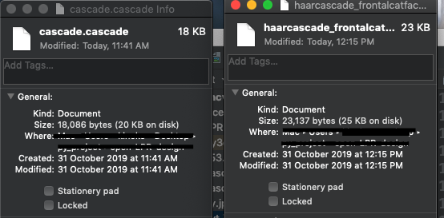
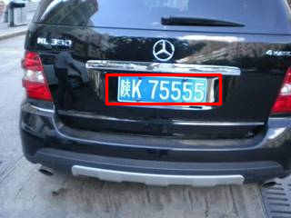

## Openmv 车牌识别

### 题目要求
采用摄像头识别小车车牌，可存储拍照时间、小车图片等。发挥部分：可存储100个以上车牌进行比对。

### 当前思路
* 做完全成熟的车牌识别需要车牌定位(位置)+车牌识别(内容)，不知道能做到什么程度
* Haar Cascades做车牌检测

### 需要完成的任务清单

* Haar Cascades的训练脚本的完善，但是可能不会重新训练，也许？
* 性能优化，以后的事了，内存优化就一个字，del
* 现在都是一张图的静态分析，也许以后要动态画框？

### essay

* 2019-10-31
拿到题目我本来以为是要直接做识别内容车牌，吓死我了，我思考了一晚上能不能在openmv上面跑CNN，看了半天LPRNet的论文，最后想想，为什么要加一个发挥部分呢，也许只是直接比对，可以直接对比像素值就OK了，就先打算把车牌检测弄出来，用OpenCV Haar Cascades弄了出来，然后在openmv的官网发现有这么一段话:
> 您可以制作自己的Haar Cascades 来配合您的OpenMV Cam 使用。 首先，使用谷歌搜索“<thing> Haar Cascade”，检测是否有人已经为您想要检测的对象制作了OpenCV Haar Cascade。 如果没有，那您需要自己动手制作（工作量巨大）。 关于如何制作自己的Haar Cascade，见此 关于如何把OpenCV Haar Cascades转化成您的OpenMV Cam可以读取的模式

啊啦，意思我检测车牌这个模型在上面跑是ok的，然后在官方开源找到了转换脚本。

因为全部东西都要在性能堪忧的嵌入式平台，我对比了一下官方在GitHub给出的模型:

左边是我压缩的我的车牌检测模型，右边是压缩的官方的猫脸模型。转换脚本均使用官方提供。

使用openmv分辨率320X240的某图在opencv-python的结果

### reference

基于深度学习高性能中文车牌识别[HyperLPR](https://github.com/zeusees/HyperLPR)

[OpenCV Cascade Classifier](https://docs.opencv.org/trunk/db/d28/tutorial_cascade_classifier.html)

